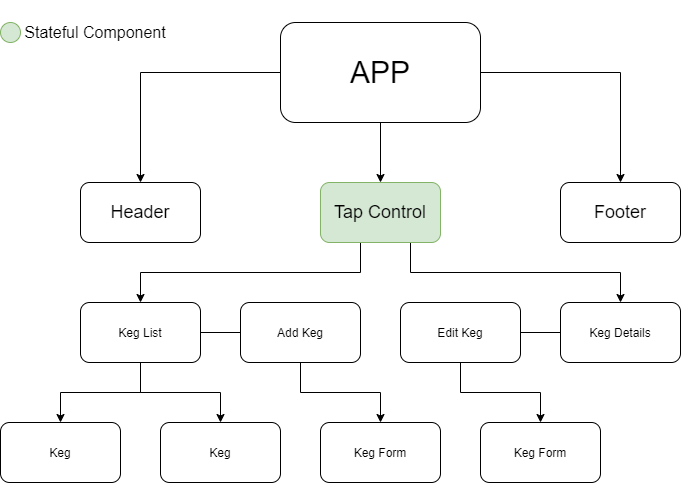

# Tapper

#### By Cory Nordenbrock
##### 2/16/20

## _What_ does it do?

* This web app allows a barkeep to track and manage inventory for a hypothetical taproom. 

## _Why_ does it do?

* This project was prompted by the wonderful people at [Epicodus](https://www.epicodus.com/) as an exercise in building a basic React web app with a full CRUD interface. Additionally, it explores using one stateful component to manage local state and shared state among child components.

## _Component Tree_

## Setup Instructions

* _Requirements_

1. Node/npm

* To run program:

1. Clone this repository: ` git clone https://github.com/cordenbrock/tapper.git `
2. Navigate to this specific directory from project folder root: ` cd tapper `
3. Run the program in in your terminal with a ` npm start ` command 

## Built with/Tools used

* _React_
* _Bootstrap_
* _HTML_
* _VS Code_

### Known Bugs/Future Improvements

* Add CSS to indicate low tap status

### Legal

MIT License, (c) 2020 Cory Nordenbrock